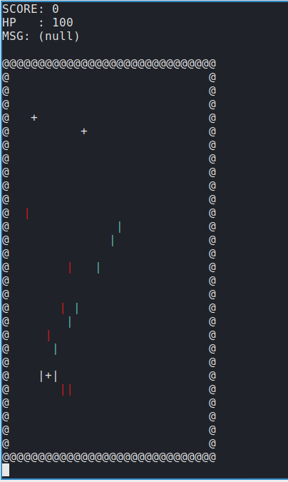

# SHOOTER - terminal shooting game
Shooter is a terminal shooting game written in C.



## Goals?
No goal No plan. Purely for fun.


## TODO
* Fix includes for building in Windows

TODOs are written in source code like this

If you found something to fix, feel free to write your // # TODO in source code.

```rb
// # TODO
// Consider the body of the object 
int NextIsWall(int x, int y, enum Direction direction) {
    switch (direction) {
        case UP   : return (!strcmp(map_data[y - 1][x], "@"));
        case DOWN : return (!strcmp(map_data[y + 1][x], "@"));
        case RIGHT: return (!strcmp(map_data[y][x + 1], "@"));
        case LEFT : return (!strcmp(map_data[y][x - 1], "@"));
    }
}
```

## BUILD
* To build in Windows, fixing some includes is necessary. TODO!!
```rb
git clone https://github.com/takaserio/shooterPR.git
cd shooterPR
make
```

## Contribute
I basically accept all pull requests.

Implement any functionality you want!

Cool menus, cool maps, cool effects...

Have fun!